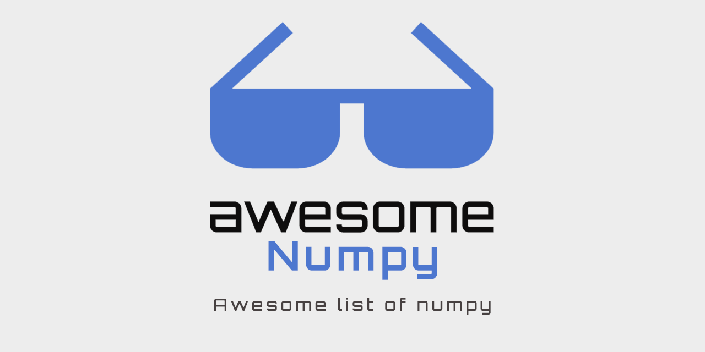

<h1 align="center">Awesome NumPy</h1>

 Awesome list of numpy

    

## Contents

- [Ecosystem](#ecosystem)
   - [Core](#core)
   - [Hardware acceleration](#hardware-acceleration)
   - [Jit Compiler](#jit-compiler)
   - [AI/ML](#aiml)
- [Community](#community)
   - [Conference](#conference)
   - [Channels](#channels)
   - [Roadmap & Milestones](#roadmap-milestones)
- [Materials](#materials)
   - [Books](#books)
   - [Videos](#videos)
   - [Reading Materials](#reading-materials)

## Ecosystem

### Core

- [NumPy](https://numpy.org/) - Main project of NumPy.
- [SciPy](https://scipy.org/) - Extends NumPy for data science purpose.

#### Core dependencies

- [ATLAS](http://math-atlas.sourceforge.net/) - Automatically Tuned Linear Algebra Software.
- [BLAS](http://www.netlib.org/blas/) - Basic Linear Algebra Subprograms.
- [LAPACK](http://www.netlib.org/lapack/) - Linera Algebra Package.
- [FFT](https://www.fftw.org/) - library for efficient computation of the discrete Fourier transform.

### Extended library

- [Blaze](https://blaze.readthedocs.io/en/latest/index.html) - A high-level library, It provides compatible interface with NumPy.
- [Numexpr](https://github.com/pydata/numexpr) - Fast numerical expression evaluator for NumPy.

### Hardware acceleration

- [CuPy](https://github.com/cupy/cupy) - NumPy-compatible library for GPU-accelerated computing.

### Distributed Computing

- [Dask](https://dask.org/) - Distributed computing platform for NumPy and Pandas.

### JIT Compiler

- [Numba](https://numba.pydata.org/) - JIT compiler that translates a subset of NumPy.

### AI/ML

- [JAX](https://github.com/google/jax) - Extends NumPy by ML purpose, [Autograd](https://github.com/hips/autograd) and [XLA](https://www.tensorflow.org/xla) project.
- [AutoGrad](https://github.com/HIPS/autograd) - Efficiently computes derivatives of numpy code.
- [TensorFlow NumPy](https://www.tensorflow.org/guide/tf_numpy) - A subset of the NumPy API implemented in TensorFlow.
- [NumPy ML](https://github.com/ddbourgin/numpy-ml) - Collection of ML models, algorithms, & tools using NumPy and Python standard lib.

## Community

### Conference

- [SciPy US](http://conference.scipy.org/)
- [EuroSciPy](https://www.euroscipy.org/)
- [SciPy India](https://scipy.in/2021)
- [PyData](https://pydata.org/event-schedule/)
- [PyCon](https://pycon.org/)
- [O'Reilly AI Conference](https://www.oreilly.com/conferences/)

### Channels

- [NumPy Slack](https://numpy-team.slack.com/)

### Roadmap & Milestones

- [The Scope of NumPy](https://numpy.org/neps/scope.html)
- [Roadmap](https://numpy.org/neps/)
- [Wish List](https://github.com/numpy/numpy/issues?q=is%3Aopen+is%3Aissue+label%3A%2223+-+Wish+List%22)

## Materials

### Books

- [Guide to NumPy - Travis E. Oliphant, PhD](http://web.mit.edu/dvp/Public/numpybook.pdf)
- [From Python to Numpy - Nicolas P. Rougier](https://www.labri.fr/perso/nrougier/from-python-to-numpy/)
- [Elegant SciPy - Juan Nunez-Iglesias](https://books.google.com/books?id=4tOdjgEACAAJ)
- [Numerical Python - Robert Johansson](https://books.google.com/books?id=N4-dvAEACAAJ)

### Videos

- [Inside NumPy - Barkeley Institute for Data Science (BIDS)](https://www.youtube.com/watch?v=fowHwlpGb34)

### Reading Materials

- [NumPy Cheat Sheet: Data Analysis in Python](https://www.datacamp.com/cheat-sheet/numpy-cheat-sheet-data-analysis-in-python)
- [Faster Python calculations with Numba: 2 lines of code, 13× speed-up](https://pythonspeed.com/articles/numba-faster-python/)
